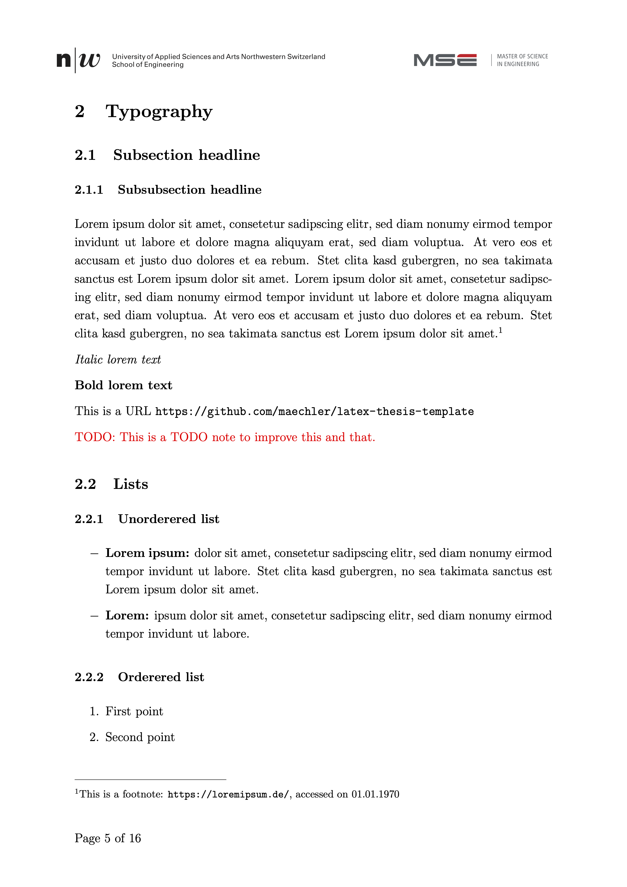

# LaTeX thesis template

This is a LaTeX thesis template that is meant as a kick start for academic works in the field of Computer Science.
Although it is inspired by the requirements of the [FHNW](https://www.fhnw.ch/) and the [MSE](https://www.msengineering.ch/), it is not an official template and is provided without any warranty.

See the resulting [PDF](Thesis.pdf).

## Features

- A title page
- An abstract including a guide on writing abstracts
- A table of contents
- Different typography styles
- Source code syntax highlighting
- Different image layouts
- Formulas
- Quotations
- A glossary
- List of figures and tables
- Declaration of academic integrity
- An appendix

## Template preview

